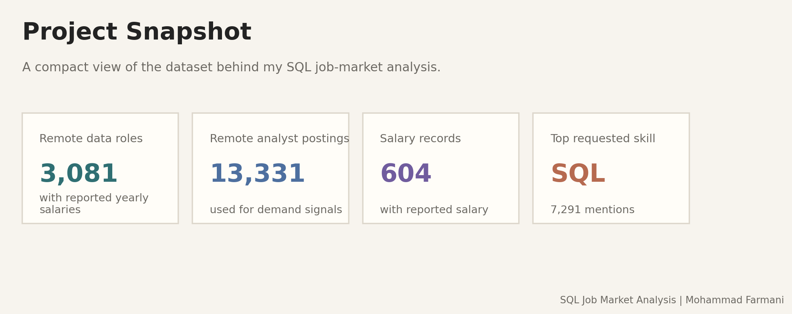
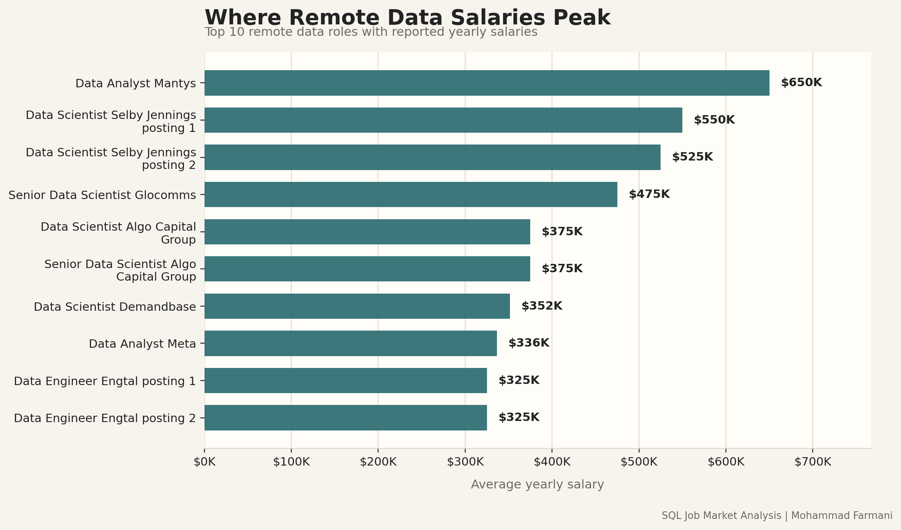
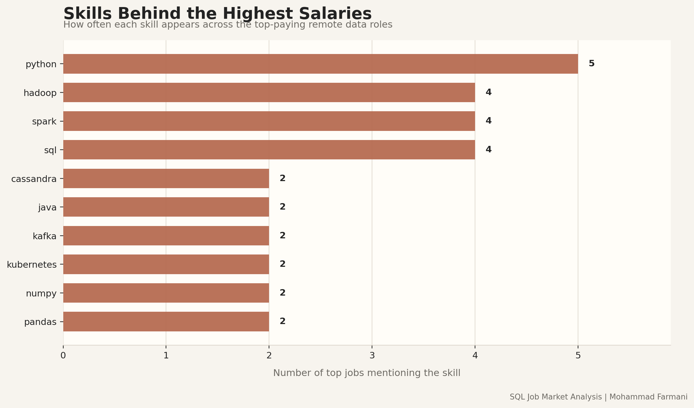
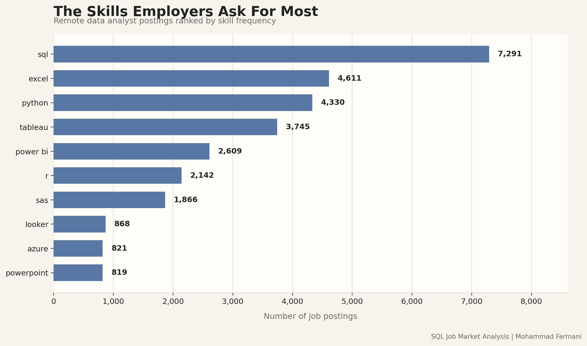
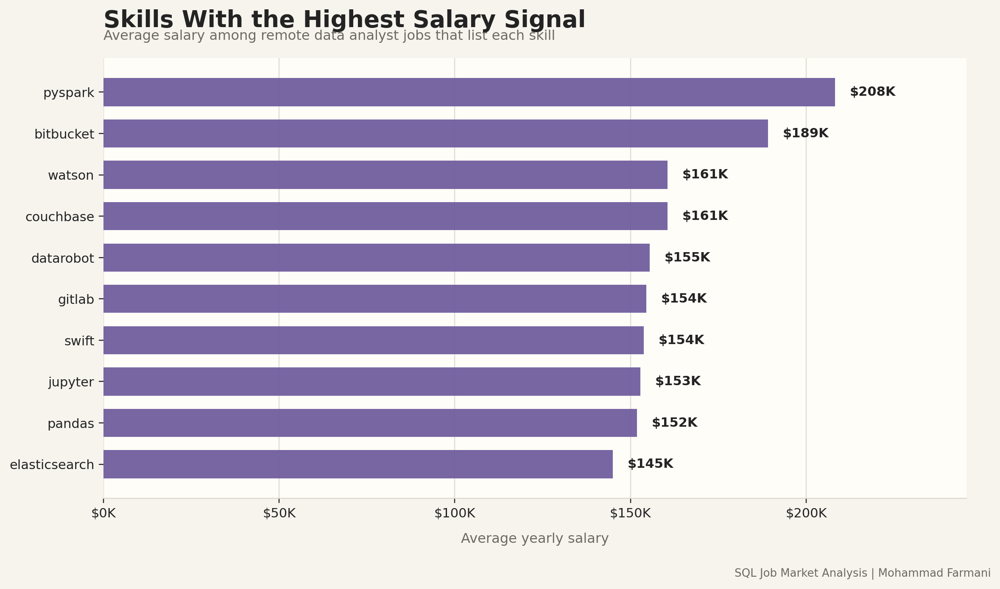
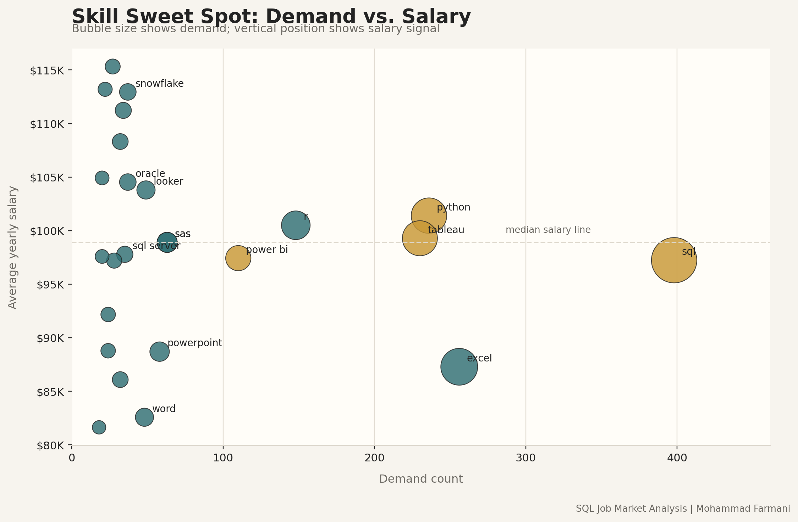

# Remote Data Jobs: SQL Market Analysis

I am Mohammad Farmani, and I rebuilt this project as a practical SQL portfolio piece: not to reproduce a tutorial, but to practice the kind of data investigation I would use when making career and skill-development decisions.

The project studies remote data roles using job-posting data. I focused on salary, demand, and skill patterns because those three signals answer a very direct question: *which skills are worth prioritizing if I want to grow into stronger data roles?*



## My Angle

Many SQL projects stop after showing the query result. I wanted this one to feel closer to an analytical report:

- start with a real job-market question,
- use SQL to extract evidence,
- compare demand against salary,
- turn the results into readable visuals,
- and finish with a personal learning strategy.

The data comes from the [Luke Barousse SQL course](https://lukebarousse.com/sql), but the analysis, organization, visuals, and interpretation here are customized for my own portfolio.

## Repository Map

```text
.
|-- csv_files/          # Source CSV files used for loading and plotting
|-- project_sql/        # SQL queries for the analysis
|-- scripts/            # Reproducible Python plotting script
|-- sql_load/           # Database setup and table loading scripts
`-- assets/             # Generated README figures
```

## Questions I Asked

1. Which remote data jobs report the highest salaries?
2. Which skills appear in those top-paying roles?
3. Which skills are most frequently requested for remote data analyst jobs?
4. Which skills are linked with the highest average salaries?
5. Which skills balance demand and salary well enough to be worth learning next?

## Tools

- **PostgreSQL** for querying the relational tables.
- **SQL** for joins, filters, aggregation, salary ranking, and skill-demand analysis.
- **Python, pandas, and Matplotlib** for reproducible plots.
- **VS Code** for writing and organizing the analysis.
- **Git and GitHub** for version control and presentation.

## Analysis Highlights

### 1. Highest-Paying Remote Data Roles

The first query filters for remote roles with reported yearly salary and keeps data-related job titles. I used this as the entry point because salary outliers reveal which parts of the data job market are priced most aggressively.

Query file: [project_sql/1_top_paying_jobs.sql](project_sql/1_top_paying_jobs.sql)



My read: the top of the salary distribution is not limited to one title. Data scientist, data engineer, and senior data roles all appear, which tells me that the higher-paying path is connected to deeper technical responsibility rather than one narrow job label.

### 2. Skills Attached to the Top Salaries

After finding the highest-paying roles, I joined those jobs to the skill tables. This is where the project becomes more useful: salary by itself is interesting, but salary plus skills gives a clearer learning direction.

Query file: [project_sql/2_top_paying_jobs_skills.sql](project_sql/2_top_paying_jobs_skills.sql)



My read: SQL and Python show up as core skills, but the higher-paying roles also reward tools connected to data engineering, distributed processing, and production analytics. That is a useful signal for me because it suggests a path beyond dashboard-only analysis.

### 3. Most Requested Skills for Remote Data Analysts

For demand, I narrowed the scope to remote data analyst postings. This keeps the interpretation cleaner: I am not mixing analyst, engineer, and scientist expectations when measuring what employers ask analysts to know.

Query file: [project_sql/3_top_demanded_skills.sql](project_sql/3_top_demanded_skills.sql)

| Skill | Demand Count |
|---|---:|
| SQL | 7,291 |
| Excel | 4,611 |
| Python | 4,330 |
| Tableau | 3,745 |
| Power BI | 2,609 |



My read: SQL is the baseline. Excel is still heavily present, and Python plus visualization tools form the practical bridge between analysis and communication.

### 4. Skills With the Strongest Salary Signal

This part calculates average salary by skill for remote data analyst jobs with reported salary. I treat this as a salary signal, not a perfect causal claim, because job salaries are influenced by role seniority, company type, and other requirements too.

Query file: [project_sql/4_top_paying_skills.sql](project_sql/4_top_paying_skills.sql)

| Skill | Average Salary |
|---|---:|
| pyspark | $208,172 |
| bitbucket | $189,155 |
| couchbase | $160,515 |
| watson | $160,515 |
| datarobot | $155,486 |
| gitlab | $154,500 |
| swift | $153,750 |
| jupyter | $152,777 |
| pandas | $151,821 |
| elasticsearch | $145,000 |



My read: the strongest salary signals are tied to scalable data work, machine learning workflows, software tooling, and infrastructure. For my own development, that means SQL alone is not the finish line; it is the foundation.

### 5. The Skill Sweet Spot

The final query combines demand and salary. I filtered out very rare skills by requiring more than 10 mentions, then ranked by demand and salary. This helps separate broadly useful skills from niche, high-salary outliers.

Query file: [project_sql/5_optimal_skills.sql](project_sql/5_optimal_skills.sql)

| Skill | Demand Count | Average Salary |
|---|---:|---:|
| SQL | 398 | $97,237 |
| Excel | 256 | $87,288 |
| Python | 236 | $101,397 |
| Tableau | 230 | $99,288 |
| R | 148 | $100,499 |
| Power BI | 110 | $97,431 |
| SAS | 63 | $98,902 |
| PowerPoint | 58 | $88,701 |
| Looker | 49 | $103,795 |



My read: SQL and Python are the best foundation because they combine demand, flexibility, and salary strength. Visualization tools are essential for analyst roles, while cloud and big-data tools are the next layer for moving toward higher-value technical work.

## How I Generate the Plots

I added a reproducible plotting workflow so the figures do not depend on screenshots or manual chart editing.

```bash
python3 -m pip install pandas matplotlib
python3 scripts/generate_plots.py
```

The script reads the CSV files, recreates the joins and aggregations used in the SQL analysis, and saves polished PNG charts into `assets/`.

My recommended workflow is:

1. Use PostgreSQL to develop and validate the query logic.
2. Keep final SQL files in `project_sql/`.
3. Use `scripts/generate_plots.py` to regenerate the visual report.
4. Commit the updated `README.md`, `scripts/`, and `assets/` files.

## What This Project Shows About Me

This project shows that I can move through a full analysis cycle: define a question, query relational data, validate patterns, summarize results, and communicate the findings visually. It also reflects how I like to learn: I use projects to connect technical practice with a real decision.

## Main Takeaways

SQL is the most important skill in this dataset, both because it is highly demanded and because it supports nearly every other data workflow. Python adds flexibility and helps move from querying to analysis automation. Tableau and Power BI matter because data work still has to be communicated clearly.

For my next step, I would prioritize a stack like this:

1. **SQL + Python** as the technical core.
2. **Tableau or Power BI** for communication and dashboarding.
3. **Cloud and data engineering tools** such as Snowflake, AWS, Azure, BigQuery, and PySpark for higher-paying technical roles.

That learning path is the real value of this project for me: it turns a job-posting dataset into a personal roadmap.
